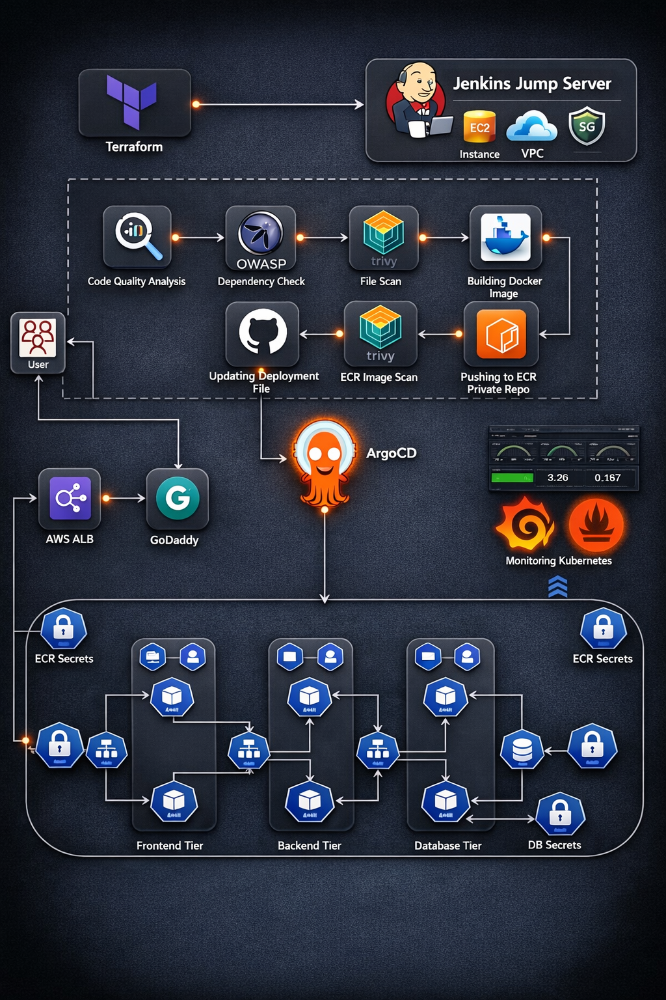

# 🚀 DevOps Arsenal: End-to-End DevSecOps Kubernetes Project


A production-grade implementation of a Three-Tier MERN Application (MongoDB, Express, React, Node) deployed on **AWS EKS** using a secure CI/CD pipeline. This project demonstrates the complete DevSecOps lifecycle, from Infrastructure Provisioning to Monitoring.

---

## 🏗️ Architecture



The workflow follows industry best practices:
1.  **Infrastructure as Code:** Terraform provisions the VPC, EC2 (Jenkins), and EKS Cluster.
2.  **Configuration Management:** Ansible configures the Jenkins Server with necessary tools.
3.  **CI Pipeline (Jenkins):** Code Checkout → Unit Tests → SonarQube Analysis → Security Scans (Trivy/OWASP) → Docker Build → Push to ECR.
4.  **CD Pipeline (GitOps):** Automatic updates to Kubernetes manifests using ArgoCD/Jenkins.
5.  **Secure Networking:** Application runs on EKS with an **Nginx Reverse Proxy** sidecar pattern, allowing secure `ClusterIP` communication between Frontend and Backend without exposing internal APIs.

---

## 🛠️ Tech Stack

| Domain | Technologies |
| :--- | :--- |
| **Cloud Provider** | AWS (EKS, EC2, ECR, IAM, ALB, VPC, Route53) |
| **Infrastructure as Code** | Terraform |
| **Configuration Mgmt** | Ansible, Shell Scripting |
| **CI/CD** | Jenkins (Groovy Pipeline), ArgoCD |
| **Containerization** | Docker, Docker Compose |
| **Orchestration** | Kubernetes (EKS), Helm |
| **Security (DevSecOps)** | SonarQube, OWASP Dependency Check, Trivy |
| **Application** | React.js (Frontend), Node.js/Express (Backend), MongoDB (DB) |
| **Monitoring** | Prometheus, Grafana |

---

## ✨ Key Features

* **1-Click Infrastructure:** Complete environment provisioning using Terraform.
* **DevSecOps Integration:** Automated vulnerability scanning for files and Docker images before deployment.
* **Dynamic Versioning:** Automatic Docker image tagging and ECR pushing via Jenkins.
* **Cost-Optimized:** Uses `ClusterIP` and Nginx Reverse Proxy to reduce AWS Load Balancer costs.
* **Zero-Downtime Deployment:** Kubernetes `RollingUpdate` strategy ensures high availability.
* **Ingress Controller:** AWS ALB Ingress Controller configured for path-based routing.

---

## 📂 Repository Structure

```bash
├── Application-Code/       # Source code for MERN App
│   ├── frontend/           # React App + Nginx Config + Dockerfile
│   └── backend/            # Node.js API + Dockerfile
├── K8s-manifests-files/    # K8s Manifests (Deployments, Services, Ingress, Secrets)
├── Jenkins-Server-tf/      # IaC scripts (main.tf, variables.tf, vpc.tf)
├── Jenkins-files           # Declarative CI/CD Pipeline
└── README.md               # Project Documentation
```
---

# 🚀 Getting Started

### Application-Code
The `Application-Code` directory contains the source code for the Three-Tier Web Application. Dive into this directory to explore the frontend and backend implementations.

### Jenkins-files
In the `Jenkins-files` directory, you'll find Jenkins pipeline scripts. These scripts automate the CI/CD process, ensuring smooth integration and deployment of your application.

### Jenkins-Server-tf
Explore the `Jenkins-Server-tf` directory to find Terraform scripts for setting up the Jenkins Server on AWS. These scripts simplify the infrastructure provisioning process.

### K8s-manifests-files
The `K8s-manifests-files` directory holds Kubernetes manifests for deploying your application on AWS EKS/Kubernetes. Understand and customize these files to suit your project needs.

---

## 🏗️ Architecture & Workflow

The workflow is divided into two major stages: **Infrastructure Provisioning** and **Application Deployment**.

### 1. Infrastructure Stage (Terraform)
Located in `Jenkins-Server-tf/`, Terraform automates the setup of the build environment:
* Provisions a **VPC**, Public Subnets, and Security Groups.
* Launches an **EC2 Instance** to serve as the Jenkins Controller.
* **User Data Script (`userdata-tools-install.sh`):** Automatically installs Jenkins, Docker, Trivy, and Kubectl on startup.

### 2. Deployment Stage (Jenkins & Kubernetes)
Located in `Jenkins-files/` and `K8s-manifests-files/`:
* **Jenkins Pipelines:**
    * **Build:** Dockerizes `Application-Code/frontend` and `Application-Code/backend`.
    * **Scan:** (Optional) Scans images using Trivy for vulnerabilities.
    * **Push:** Uploads artifacts to Docker Hub / ECR.
    * **Deploy:** execution of `kubectl apply` commands.
* **Kubernetes Cluster:**
    * Runs the Frontend and Backend as stateless deployments.
    * Runs MongoDB as a StatefulSet with Persistent Volume Claims (PVC).
    * Exposes the app via Services and Ingress.

---

## 🛠️ Prerequisites

* **AWS Account** with active Access Keys.
* **Terraform CLI** installed locally.
* **Kubernetes Cluster** EKS running and accessible.
* **ECR**. Storing images of backend & frontend 

---

## 🚀 Step-by-Step Deployment Guide

### Phase 1: Provision Jenkins Server

1.  **Navigate to the Terraform directory:**
    ```bash
    cd Jenkins-Server-tf
    ```

2.  **Initialize and Apply Terraform:**
    ```bash
    terraform init
    terraform validate
    terraform plan
    terraform apply --auto-approve
    ```

3.  **Access Jenkins:**
    * Copy the `jenkins_public_ip` output from the Terraform console.
    * Open `http://<YOUR-IP>:8080` in your browser.
    * **Unlock Jenkins:** 
        ```bash
        sudo cat /var/lib/jenkins/secrets/initialAdminPassword
        ```

### Phase 2: Configure Jenkins

1.  **Install Required Plugins:**
    * *Manage Jenkins → Plugins → Available Plugins*:
    * Install: `Docker Pipeline`, `Kubernetes CLI`, `NodeJS`, `Pipeline: Stage View`, `Terraform`, `Sonarqube`, `owasp`.

2.  **Configure Credentials:**

3.  **Set up Global Tools:**
    * *Manage Jenkins → Tools*:
    * Ensure **JDK**, **Git**, and **NodeJS** are configured.

### Phase 3: Run Pipelines

1.  **Create Frontend Job:**
    * New Item → Pipeline → Name: `frontend-deploy`.
    * **Definition:** Pipeline script from SCM (Git).
    * **Script Path:** `Jenkins-files/frontend.yml`.

2.  **Create Backend Job:**
    * New Item → Pipeline → Name: `backend-deploy`.
    * **Definition:** Pipeline script from SCM (Git).
    * **Script Path:** `Jenkins-files/backend.yml`.

3.  **Trigger Builds:**
    * Run the **Backend** pipeline first.
    * Run the **Frontend** pipeline next.

### Phase 4: Verify Deployment

Connect to your Kubernetes cluster terminal and run:

```bash
# Check if pods are running
kubectl get pods -n <your-namespace>

# Check services
kubectl get svc -n <your-namespace>

# Get Ingress URL
kubectl get ingress -n <your-namespace>
```
---

## 🐙 GitOps & Observability

This project now utilizes **ArgoCD** for continuous delivery and **Prometheus/Grafana** for monitoring.

### ArgoCD Setup
ArgoCD watches the `K8s-manifests-files/` directory. Any changes pushed to GitHub are automatically applied to the cluster.

1. **ArgoCD setup:**
```bash
kubectl create namespace argocd

# Install ArgoCD
kubectl apply -n argocd -f https://raw.githubusercontent.com/argoproj/argo-cd/stable/manifests/install.yaml
```

2. **Check Status:**
    ```bash
    kubectl get all -n argocd
    ```

### Monitoring 
- Monitoring (Prometheus & Grafana)
- The best way to install monitoring is using the Kube-Prometheus-Stack Helm chart, which includes Prometheus, Grafana, Alertmanager, and node-exporters.

# 🤝 Contributing
- Fork the repository.

- Create a feature branch (git checkout -b feature/AmazingFeature).

- Commit changes (git commit -m 'Add AmazingFeature').

- Push to branch (git push origin feature/AmazingFeature).

- Open a Pull Request.
---


